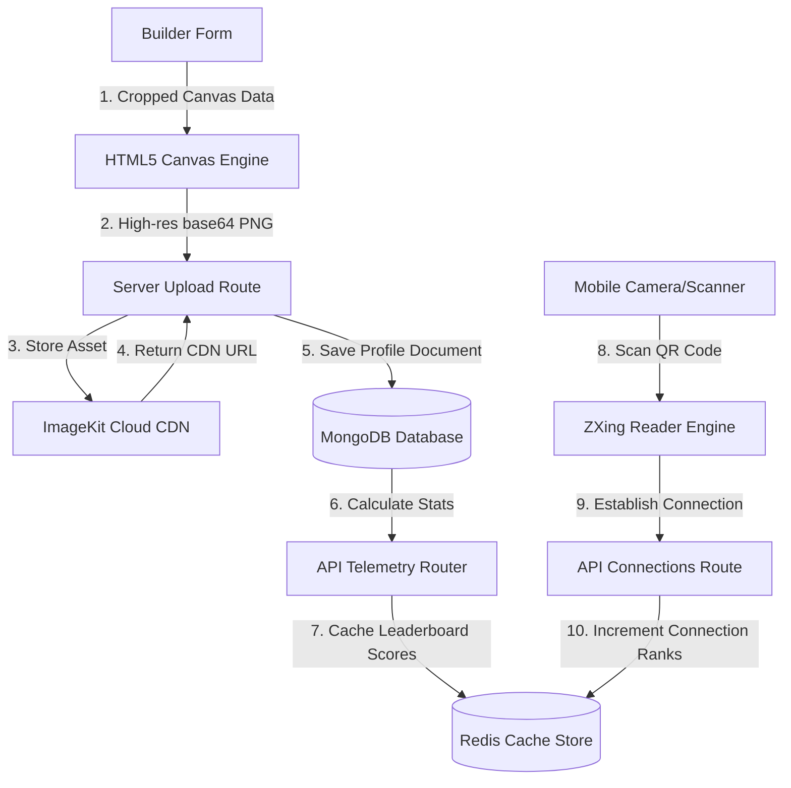

# 🌴 Hacker House Goa: Builder Passport & Networking Network

An interactive, neobrutalist builder passport generator, digital networking directory, and engagement leaderboard built specifically for the **Hacker House Goa 2026** community. 

This platform allows event participants to construct high-resolution branded badges, share profile statistics, scan peer QR codes to record face-to-face connections, unlock smart collaborator suggestions, and compete on a live connection leaderboard.

---

## 📂 System Architecture & Data Flow

The platform is designed as a secure, fast, and scalable distributed system connecting client-side canvases, cloud CDN stores, Mongoose ODM schemas, and a Redis connection scoring cache:



---

## 🛠 In-Depth Tech Stack & Configuration

The codebase utilizes a cohesive, modern technical stack optimized for sub-second responses and high visual polish:

### 1. Frontend & Routing Core
* **Next.js 15 (App Router)**: Leverages Server Actions, API routes, client components, and optimized dynamic bundles.
* **React Hook Form & Zod**: Performs strict schema-based form validations and client-side error parsing for builder details.
* **Framer Motion**: Controls page entry transitions, neobrutalist warnings, and interactive navigation drawer toggles.

### 2. Canvas Rendering & Image Optimization
* **HTML5 Canvas 2D Engine**: Creates a vertical $600 \times 900\text{px}$ badge composed of:
  * Dynamic diagonal retro-green background stripes.
  * Vector beach waves (sinusoidal offset paths).
  * Layered Goa sunrise discs.
  * A retro hacker terminal block (`HACKER_PROFILE.SH`) presenting the user's role, stack, city, and name.
* **ImageKit CDN**: Integrated via a secure client-token authentication router (`/api/imagekit/auth`) to upload generated PNGs, optimize delivery formats, and cache profile images at edge locations.

### 3. Database & Distributed Cache
* **MongoDB & Mongoose**: Stores persistent profiles, account hashes, and connected builder lists. Schema schemas enforce validation for name, role, tech stack, and handles.
* **Redis Caching**: Powering the leaderboard. Connection ranks are calculated using sorted sets (`ZINCRBY`) on Redis, caching stats locally to avoid costly database aggregate queries.

---

## 🌟 Detailed Feature Breakdown

### A. Professional Canvas Customizations & Fallbacks
* **Image Crop & Pan**: Slider-driven zoom (`1.0x` to `3.0x`), horizontal pan, and vertical pan controls modify the drawing offset values dynamically.
* **Aspect Ratio Centering**: Identifies portrait uploads (`height > width`) and applies a top-focus shift `(dh - 300) * 0.35` to automatically center faces.
* **Custom Templates**: Detects `public/brand/background.png` (dimensions $600\times900\text{px}$) and renders it as the canvas background. If missing, a secure try-catch fallback draws the default retro palm-green stripes to ensure absolute render uptime.
* **Clean Borderless Render**: Removes thick outer borders and frames, allowing the canvas graphics to stand alone.

### B. Event QR Scanner & Fallback Captures
* **Real-time Camera Reader**: Built using `@zxing/library` to acquire device media streams, decode QR connection data, and redirect to the connector endpoints.
* **Image Upload Reader**: A fallback file-upload processor decodes screenshots of QR codes directly inside the browser using JavaScript reader elements when camera permission is unavailable.

### C. Reclaim Login & Overwrite Protection
* **Case-Insensitive Regex Queries**: Users can enter their Builder Name on another device to query the database case-insensitively and restore their session cookie securely.
* **Passcode PIN Protection**: Protects identities using `bcryptjs` hashing.
* **Neobrutalist Warn Overlays**: A custom popup warns users when they attempt to generate a new badge that would overwrite their active profile.

### D. Networking Telemetry & Analytics
* **Connection Stats**: Computes total builders met, diversity index (variety of roles/stacks met), and unique skills encountered.
* **Matchmaking Recommendations**: API-driven engine suggests complementary stack profiles (e.g., matching a Frontend Gladiator with a Backend Alchemist) to facilitate face-to-face meetups.

---

## 🏁 Quickstart

To run the project locally:

```bash
# 1. Install dependencies
npm install

# 2. Run Next.js Development Server
npm run dev

# 3. Compile Production Bundle
npm run build
```
