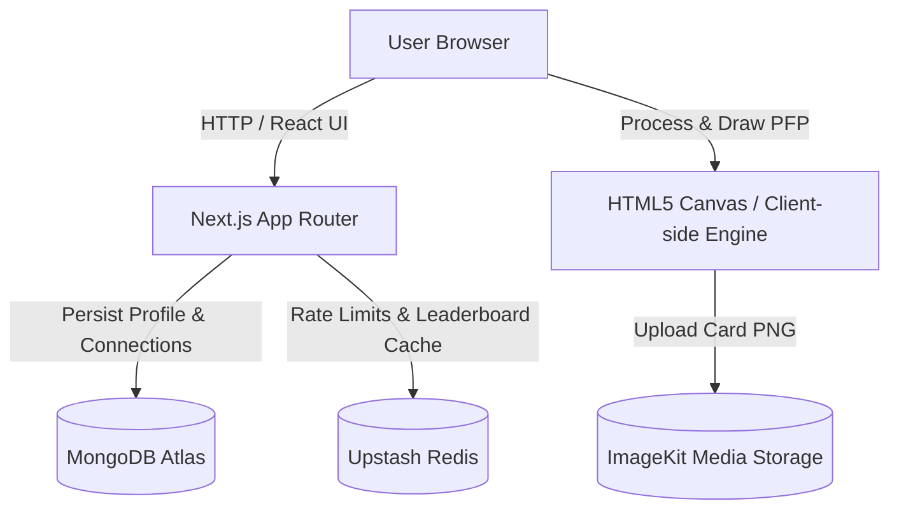
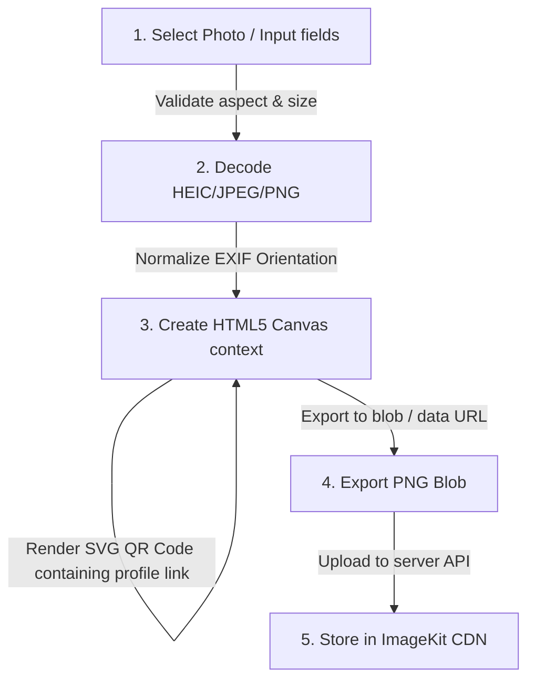

# System Architecture - Hacker House Goa Builder Network

This document details the software architecture, visual compilation pipeline, and directory layout for the application.

## 1. High-Level Architecture

The product is built as a single-repo Next.js App Router application deployed on Vercel. It interacts with MongoDB Atlas, ImageKit, and Upstash Redis.



## 2. Core Modules & Engine Pipelines

### A. Client-Side Image Rendering Engine
Large images processed on the server can easily crash Vercel Serverless Functions due to payload sizes or execution timeout. The image composition is fully offloaded to the client browser's HTML5 Canvas.



### B. Networking Core & Session Mapping
1. **Anonymous Session**: When a user creates their Builder ID, the server issues a JWT-based session token stored in an HTTP-only secure cookie.
2. **QR connection**: The token encodes a random string. Scans resolve to `/connect/[token]`. When clicked, the backend checks the caller's session token and registers a connection.

---

## 3. Directory Layout (Feature-Oriented)

```
/
├── public/                 # Static brand assets, fonts, illustrations
│   └── brand/              # Waves, palms, sun, scooters, houses
├── src/
│   ├── app/                # Page route files and layouts
│   ├── components/         # Shared UI components
│   │   ├── ui/             # Core visual design tokens (signboards, buttons)
│   │   ├── generator/      # Card generator form & canvas workspace
│   │   ├── network/        # Profile lists & stats cards
│   │   └── scanner/        # QR Scanner camera wrapper & fallbacks
│   ├── lib/                # Database clients, rate limiters, auth helpers
│   ├── models/             # Mongoose/MongoDB data models
│   ├── schemas/            # Zod validation schemas
│   ├── store/              # Zustand global state hooks (card details, sessions)
│   ├── styles/             # Tailwind & typography config overrides
│   └── types/              # TypeScript interface definitions
└── docs/                   # Product & developer documentation
```
