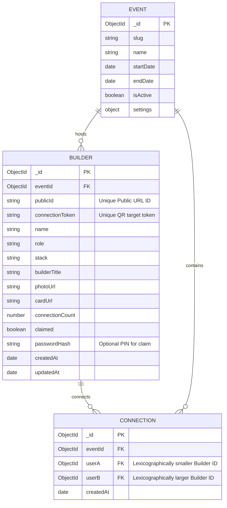

# Database Schema - Hacker House Goa Builder Network

This document details the MongoDB schemas, collections, compound indexes, and data relationships.

## 1. Entity Relationship Diagram

## 2. Collections and Fields

### A. Events (`events`)
Stores details of the Hacker House event, enabling multi-event expansion in the future.
- `_id`: ObjectId (PK)
- `slug`: string (Unique, e.g., `"hh-goa-2026"`)
- `name`: string (e.g., `"Hacker House Goa 2026"`)
- `startDate`: Date
- `endDate`: Date
- `isActive`: boolean
- `settings`: Object
  - `connectionsEnabled`: boolean
  - `leaderboardEnabled`: boolean
  - `networkEnabled`: boolean

### B. Builders (`builders`)
Stores builder profiles.
- `_id`: ObjectId (PK)
- `eventId`: ObjectId (FK -> events)
- `publicId`: string (Unique string, e.g., `"alex-sharma-209a"`, index target)
- `connectionToken`: string (Unique random token, index target)
- `name`: string
- `role`: string
- `stack`: string
- `builderTitle`: string (e.g. `"The Python Prophet"`)
- `photoUrl`: string (Optional, URL of uploaded square profile photo)
- `cardUrl`: string (URL of compiled ID Card image on ImageKit)
- `imageKitFileId`: string (Optional, for deletion/updating)
- `connectionCount`: number (Default: 0)
- `claimed`: boolean (Default: false)
- `passwordHash`: string (Optional, for session recovery)
- `createdAt`: Date
- `updatedAt`: Date

### C. Connections (`connections`)
Stores unique bidirectional developer relationships.
- `_id`: ObjectId (PK)
- `eventId`: ObjectId (FK -> events)
- `userA`: ObjectId (FK -> builders, lexicographically smaller ID)
- `userB`: ObjectId (FK -> builders, lexicographically larger ID)
- `createdAt`: Date

---

## 3. Database Indexes & Optimization

To ensure optimal query speeds on mobile devices and prevent abuse, we implement the following database indexes:

### Builders Collection Indexes
1. `{ publicId: 1 }` (Unique) - Lookups for builder profiles on `/builder/[publicId]`.
2. `{ connectionToken: 1 }` (Unique) - Resolving QR scans on `/connect/[token]`.
3. `{ eventId: 1, connectionCount: -1 }` - Fetching leaderboard list efficiently.
4. `{ eventId: 1, role: 1 }` and `{ eventId: 1, stack: 1 }` - Running developer recommendations queries.

### Connections Collection Indexes
1. `{ eventId: 1, userA: 1, userB: 1 }` (Unique) - Compulsory compound index. Prevents duplicate connections between two builders. Ensures atomic operations in transactions.
2. `{ eventId: 1, createdAt: -1 }` - Loading the list of recent network connections.
