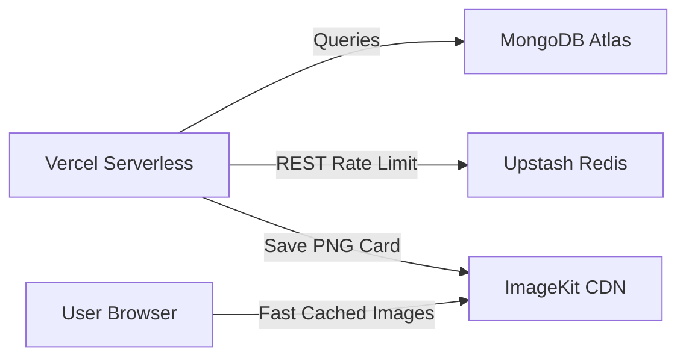

# Deployment Architecture - Hacker House Goa Builder Network

This document guides the provisioning, environment parameters, and hosting targets for the application.

## 1. Hosting Providers & Mappings

- **Frontend & API Routes**: **Vercel** (Serverless Node.js runtime).
- **Primary Database**: **MongoDB Atlas** (Shared M10 cluster or Serverless tier).
- **Session Cache & Rate Limiting**: **Upstash Redis** (Serverless Redis REST api).
- **Media Hosting & Image Caching**: **ImageKit CDN** (With default optimization transformations).

## 2. Environment Variables Configuration

An example template is provided in [.env.example](file:///c:/Users/parav/Downloads/HG/idCardGenerator/.env.example). Fill in these keys on Vercel:

| Environment Variable | Description |
| :--- | :--- |
| `MONGODB_URI` | Full connection URI (e.g. `mongodb+srv://...`) |
| `IMAGEKIT_PUBLIC_KEY` | Public key from developer dashboard (client side safe) |
| `IMAGEKIT_PRIVATE_KEY` | Private key for signature signing (server only!) |
| `IMAGEKIT_URL_ENDPOINT` | Base ImageKit URL (e.g. `https://ik.imagekit.io/your_id`) |
| `UPSTASH_REDIS_REST_URL` | REST endpoint for Redis calls |
| `UPSTASH_REDIS_REST_TOKEN` | Auth token for Upstash calls |
| `NEXT_PUBLIC_APP_URL` | Fully qualified domain (e.g. `https://hhgoa-network.vercel.app`) |
| `ADMIN_SECRET` | Passcode header string protecting organizer panel |

---

## 3. Storage Optimization & Cache Headers

### A. Card Image Fetch Caching
Since card graphics are static once generated, we append cache headers on ImageKit redirects and routes:
- Cache-Control: `public, max-age=31536000, immutable`

### B. Leaderboard Cache Strategy
Instead of querying MongoDB on every load, the `/api/leaderboard` route caches its output in Upstash Redis for **10 seconds** (`EX 10`). This bounds DB queries to at most 6 per minute under high traffic.
