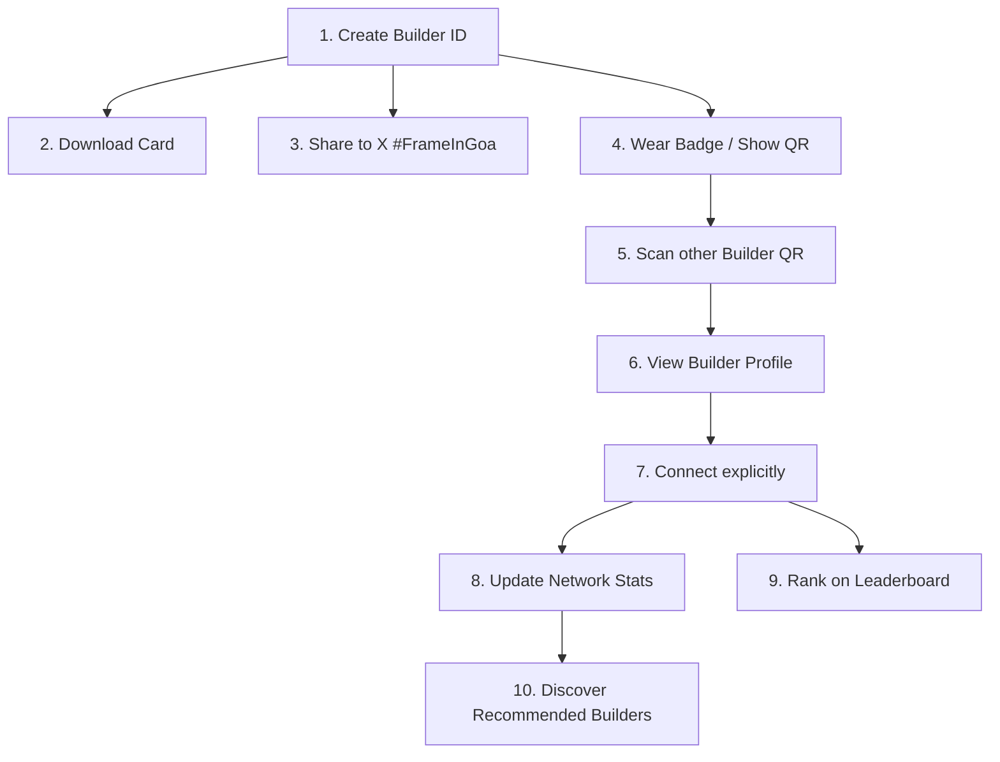

# Product Requirements Document - Hacker House Goa Builder Network

## 1. Product Concept
The **Hacker House Goa Builder Network** is a digital identity and networking application designed for builders attending Hacker House Goa 2026. 

It starts as a **Builder ID / Frame Generator** where attendees upload their photo, enter their builder details, and generate a branded visual badge containing a custom builder title and a unique QR code. 

Instead of being a static image generator, scanning the QR code redirects another attendee to the builder's profile, enabling them to explicitly **Connect**. These connections are stored securely, feeding into a personalized **My Network** dashboard (showing stats, network diversity, and recommended connections) and an event-wide **Connectors Leaderboard**.

## 2. Target Audience & Personas
- **The Builder (Hacker)**: Wants a clean, branded PFP or ID card to flex on X (Twitter). Wants to meet other developers, designers, product managers, and founders.
- **The Organizer / Admin**: Wants to track engagement, identify top networkers, and control event-wide features (toggle connections, moderate profiles).
- **The Sponsor**: Wants to see the diversity of skills and developers attending the event.

## 3. Core Journeys & User Flows
### Journey A: Card Generation (No Login Gate)
1. Builder arrives on landing page.
2. Clicks "Create Builder ID".
3. Uploads photo (supports JPG, PNG, HEIC; mobile-first).
4. Auto-crops photo dynamically (center-weighted).
5. Inputs Name, Role (Frontend, Backend, Fullstack, AI, Mobile, Design, PM, Founder), Stack (React, Go, Python, Solidity, Rust, etc.), and optional links (X, GitHub, City).
6. Generates card preview locally on a canvas decorated with official Hacker House Goa illustrations (palms, waves, scooter).
7. Downloads or shares the card. 
8. The system stores the builder in MongoDB and drops a secure anonymous session cookie in the browser.

### Journey B: Scanning and Connecting
1. Builder A opens `/scan` on their mobile phone.
2. Grants camera permission.
3. Scans Builder B's QR code (from Builder B's phone or physical badge).
4. Camera scanner reads the URL: `https://YOUR_DOMAIN/connect/[connectionToken]`.
5. Builder A views Builder B's profile showing their details and ID Card.
6. Builder A clicks the **Connect** button.
7. Backend validates the transaction, registers the connection in MongoDB, and increments connection counts for both users.
8. Displays connection animation with stats update.

### Journey C: Network Dashboard
- Access at `/network`.
- Shows total builders met, stacks/roles met, and a network diversity score.
- Lists all connected builders with dates.
- Shows AI-free deterministic recommendations (e.g. if you are a frontend developer, recommends AI or backend developers you haven't met yet).

### Journey D: The Connectors Leaderboard
- Access at `/leaderboard`.
- Shows ranking of top builders by connection count.
- Animated ranking changes.
- Top 3 builders get highlighted podium visual cards.
